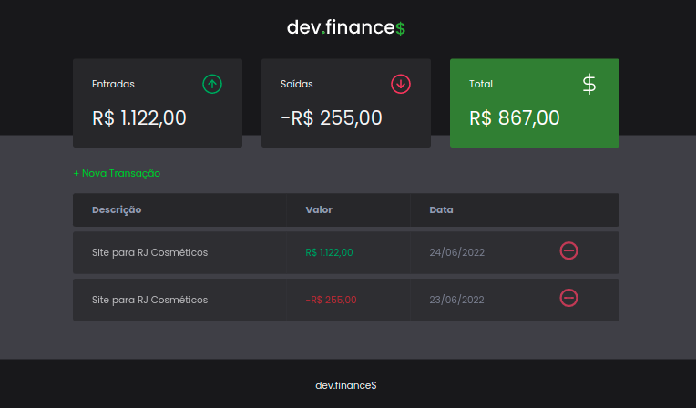

# DevFinance - Controle financeiro

> Desenvolvimento frontend de uma aplicação Web

<h1 align="center">
  
</h1>

  <a href="#-sobre-o-projeto">Sobre o projeto</a>&nbsp;&nbsp;&nbsp;|&nbsp;&nbsp;&nbsp;
  <a href="#-tecnologias">Tecnologias</a>&nbsp;&nbsp;&nbsp;|&nbsp;&nbsp;&nbsp;
  <a href="#-rodando-o-projeto">Rodando o projeto</a>&nbsp;&nbsp;&nbsp;|&nbsp;&nbsp;&nbsp;
  <a href="#-como-contribuir">Como contribuir</a>&nbsp;&nbsp;&nbsp;&nbsp;&nbsp;&nbsp;

  

## 🚀 Tecnologias

Esse projeto foi desenvolvido com as seguintes tecnologias:

- HTML
- CSS
- JavaScript

## 👨🏻‍💻 Sobre o projeto

O dev.finances é uma aplicação de controle financeiro, onde é possível cadastrar e excluir transações e ver o saldo de entrada e saída 💰

## 💻 Rodando o projeto:

1 - Clone o projeto e o abra utilizando seu editor preferido.

2 - Na raiz de arquivo do projeto, abra o arquivo `index.html` com a extensão `Live Server`.

## 👨‍🏫 Como contribuir:

- Faça um fork do projeto;
- Crie uma nova branch, exemplo: `git checkout -b my-feature`;
- Commit as modificações, exemplo: `git commit -m 'feat: My new feature'`;
- Faça um push para a sua branch: `git push origin my-feature`;

Desenvolvido por 🧗‍♂️&nbsp; Manfrinne Ferreira 🥇 [Contato](https://www.linkedin.com/in/manfrinne-ferreira-6033121a7/) - Bootcamp da Rocketseat
